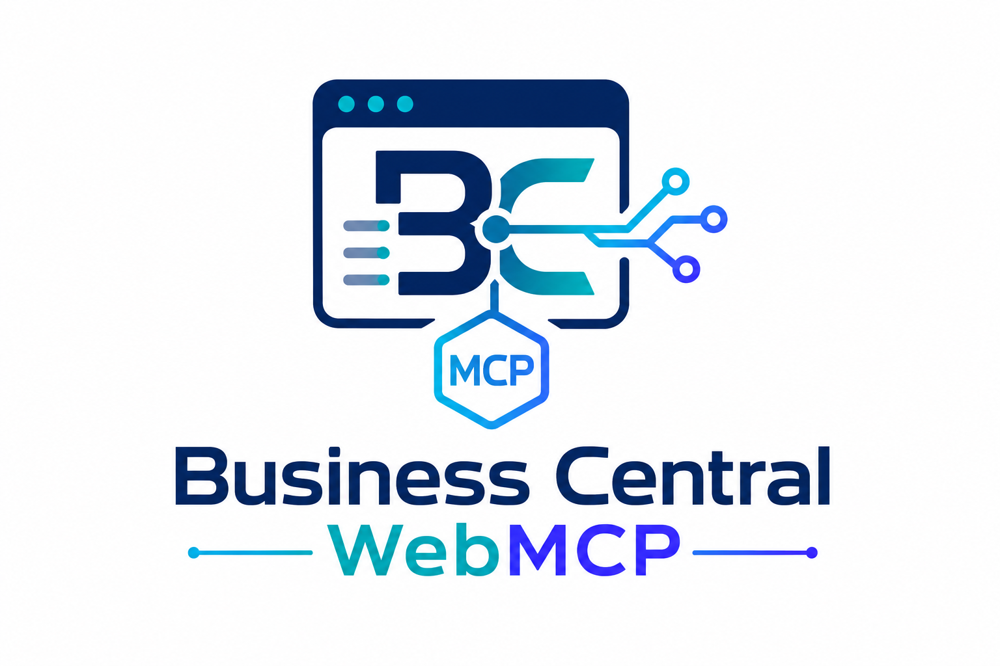

# BC WebMCP



BC WebMCP is a source-level feasibility MVP for exposing safe, structured,
page-contextual tools from Microsoft Dynamics 365 Business Central through the
experimental WebMCP browser API.

The extension adds a FactBox to the standard Customer Card and registers one
read-only tool:

```text
bc_get_current_record_primary_key
```

When invoked, the tool calls AL through a Business Central control add-in and
returns the primary key of the Customer currently displayed on the card.

## Status

The source compiles against Business Central 28/runtime 17. It has **not** been
deployed or tested for WebMCP registration, nested-frame discovery, or live
agent invocation. See [MVP feasibility result](docs/mvp-feasibility-result.md)
for the evidence checklist and current `NOT TESTED` status.

## Architecture

```text
Browser agent
  -> document.modelContext.registerTool()
  -> JavaScript pending-call map
  -> Microsoft.Dynamics.NAV.InvokeExtensibilityMethod()
  -> Customer-bound CardPart AL trigger
  -> RecordRef/KeyRef/FieldRef serializer
  -> AL calls CompleteToolCall()
  -> JavaScript resolves the WebMCP result
```

The tool returns text content containing JSON with this logical shape:

```json
{
  "application": "Microsoft Dynamics 365 Business Central",
  "tableId": 18,
  "tableName": "Customer",
  "primaryKeyPosition": "No.='10000'",
  "primaryKeyFields": [
    {
      "fieldNo": 1,
      "fieldName": "No.",
      "value": "10000"
    }
  ]
}
```

`primaryKeyPosition` uses Business Central's native `RecordRef.GetPosition`
format; its exact punctuation can vary. `primaryKeyFields` is the structured
representation consumers should use.

## Prerequisites

- Business Central online sandbox compatible with application 28/runtime 17.
- Visual Studio Code with the AL Language extension, or a local AL 17 compiler.
- Microsoft application symbols in the project's `.alpackages` directory.
- A company containing at least two Customer records for later live testing.
- A WebMCP-capable browser or ChatGPT browser surface for later feasibility
  testing.

## Configure a sandbox

Copy the tenant-neutral example and replace both placeholders locally:

```bash
cp .vscode/launch.example.json .vscode/launch.json
```

`.vscode/launch.json` is ignored so tenant and environment identifiers are not
committed. In VS Code, run **AL: Download Symbols** to populate `.alpackages`.

## Build

From the repository root:

```bash
scripts/compile-al.sh
```

The output is written to `.output/bc-webmcp.app`. The script searches installed
AL Language extension directories for `elc` or `alc`. Override discovery when
needed:

```bash
scripts/compile-al.sh \
  --compiler /absolute/path/to/alc \
  --packages /absolute/path/to/.alpackages
```

Package caches and compiled `.app` files are ignored and must not be committed.

## Install

Use either of these sandbox-only routes:

1. In VS Code, run the `BC WebMCP Sandbox` launch configuration to publish the
   development extension.
2. Compile the app, open **Extension Management** in the sandbox, and upload
   `.output/bc-webmcp.app`.

Open the Customer List and then a Customer Card after installation. Expand the
FactBox pane and make sure **BC WebMCP** is visible. Business Central lazy-loads
FactBoxes, so WebMCP registration cannot occur while the pane is collapsed or
the FactBox has not been brought into view.

## Browser setup and testing

WebMCP remains experimental, so use Chrome first to isolate browser and iframe
behavior, then use ChatGPT's built-in browser to test agent discovery. OpenAI
currently supports challenge testing in either ChatGPT's in-app browser or
Chrome with WebMCP enabled through an experimental flag or origin trial. See
the [OpenAI WebMCP Challenge](https://openai.com/webmcp-challenge/).

### Chrome: registration and bridge testing

Use a current Google Chrome build that exposes the WebMCP testing flag. Chrome
151 on macOS was confirmed to contain the flags below at the time this README
was written; their names and availability may change while the API is
experimental.

1. Open `chrome://flags/#enable-webmcp-testing`.
2. Set **WebMCP for testing** to **Enabled**.
3. Optionally open `chrome://flags/#devtools-webmcp-support` and enable
   **WebMCP support in DevTools**.
4. Relaunch Chrome completely.
5. Sign in to the Business Central sandbox and open a Customer Card.
6. Expand the FactBox pane and scroll **BC WebMCP** into view.

The FactBox diagnostic status gives the first result:

- **Unavailable** means `document.modelContext.registerTool` is not exposed in
  the control-add-in document. Confirm the flag and browser version.
- **Registered: `bc_get_current_record_primary_key`** means WebMCP exists and
  registration was permitted in that document; H1 and H2 have passed.
- **`NotAllowedError`** or **`SecurityError`** indicates that the
  Business Central-owned iframe lacks the required WebMCP `tools` permission.

For direct inspection, open DevTools, select the control-add-in iframe in the
Console's JavaScript context selector, and evaluate:

```javascript
document.modelContext
```

The experimental flag enables the API; it does not bypass iframe permissions.
Do not launch Chrome with `--disable-web-security` or similar overrides because
that would invalidate the architectural test.

### ChatGPT built-in browser: agent discovery

ChatGPT's built-in browser does not need the Chrome flag. In ChatGPT desktop,
open **Browser settings > Permissions** and ensure **Enable site tools** is on.
Open Business Central in that built-in browser and sign in again if required;
it does not necessarily share Chrome's authenticated session.

There is an important current limitation: OpenAI documents that tools provided
only by embedded content are not currently supported. A Business Central
control add-in is embedded iframe content, so ChatGPT may fail to discover this
MVP even when Chrome proves that the tool registered successfully. See
[Using site tools in the ChatGPT desktop app](https://help.openai.com/en/articles/20001423-using-site-tools-in-the-chatgpt-desktop-app).

Use this order when recording the feasibility result:

1. Prove registration and the JavaScript-to-AL-to-JavaScript bridge in Chrome.
2. Test actual agent discovery in ChatGPT's built-in browser.
3. If Chrome registration succeeds but ChatGPT discovery fails, record H3 as a
   browser/embedded-content limitation rather than an AL bridge failure.

Follow [Manual feasibility testing](docs/manual-feasibility-test.md) before
declaring the architecture GO, CONDITIONAL GO, or NO-GO.

## Scope and security

- Exactly one tool with no input fields.
- Current Customer record only.
- Read-only; no create, modify, delete, posting, or external network operation.
- Unknown tool names are rejected in AL.
- Pending requests are correlated by UUID, time out after ten seconds, and are
  rejected when the add-in document closes.
- Missing WebMCP support and registration exceptions remain visible in the
  FactBox diagnostics.

The detailed design rationale and post-MVP ideas remain in the original
[project handover](bc_webmcp_project_handover.md).

## License

MIT. See [LICENSE](LICENSE).
