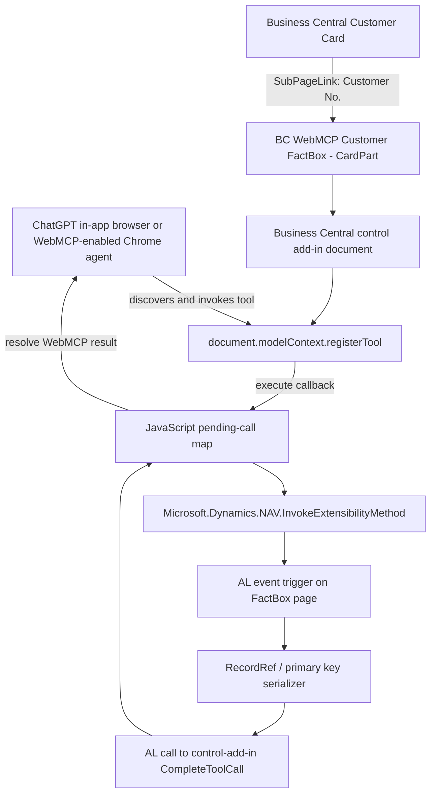

# BC WebMCP — Project Handover and MVP Feasibility Plan

| Field | Value |
|---|---|
| Document status | Initial handover and implementation baseline |
| Date | 26 August 2026 |
| Owner | Marton Nagy |
| Working project name | **BC WebMCP** — placeholder until the final Devpost name is confirmed |
| Challenge | OpenAI WebMCP Challenge |
| Submission deadline | **3 September 2026 at 13:00 Pacific Time / 21:00 BST** |
| Current phase | Feasibility spike before product implementation |

## 1. Executive summary

BC WebMCP is a proposed Microsoft Dynamics 365 Business Central extension that adds a WebMCP-enabled FactBox to standard Business Central pages. The FactBox hosts a Business Central control add-in whose JavaScript registers structured, context-aware tools through `document.modelContext.registerTool()`.

The broader product idea is to make Business Central **agent-native without replacing its interface or bypassing its application logic**. A browser agent should be able to understand the record the user is currently viewing and invoke explicitly defined Business Central operations instead of guessing its way through the visual interface.

The first milestone is deliberately not a product feature. It is a strict **go/no-go feasibility test**:

> Add a FactBox to the Customer Card and expose one read-only WebMCP tool that returns the primary key of the Customer record currently shown on the page.

The MVP must prove the full path:

```text
Browser agent
    -> WebMCP tool registered inside the BC control add-in
    -> JavaScript-to-AL invocation
    -> AL reads the current FactBox record
    -> AL-to-JavaScript response
    -> WebMCP result returned to the agent
```

The decisive technical unknown is whether the browser permits and exposes WebMCP tools registered from the browsing context generated for a Business Central control add-in. The WebMCP proposal enables the API in top-level windows and same-origin iframes by default; a cross-origin iframe requires the parent to delegate the `tools` permission. Business Central creates and owns the control add-in host, so this cannot be assumed. The MVP exists primarily to settle that question empirically.

## 2. Classification used in this handover

| Classification | Meaning |
|---|---|
| **Confirmed by Marton** | Explicitly selected in the project discussion |
| **Externally verified** | Supported by current OpenAI, WebMCP, or Microsoft documentation |
| **Proposed** | Recommended implementation choice; not yet confirmed |
| **Unknown / test required** | Must be established by the feasibility spike |

## 3. Confirmed project decisions

1. **Confirmed by Marton:** The Business Central integration should be presented as a FactBox that can eventually be added to card and other suitable pages.
2. **Confirmed by Marton:** The intended long-term model is a standard set of operations exposed from the current Business Central page context.
3. **Confirmed by Marton:** The MVP must be extremely small.
4. **Confirmed by Marton:** The MVP exposes exactly one business operation: read the primary key of the current record.
5. **Confirmed by Marton:** The project is being created for the OpenAI WebMCP Challenge on Devpost.

## 4. Externally verified foundations

### 4.1 WebMCP

WebMCP is an experimental web standard that allows a page to expose JavaScript functions as structured tools through `document.modelContext`. Tools include a name, description, input schema, execution callback, and optional annotations. Agents can discover and invoke these tools without inferring actions solely from page layout.

The current WebMCP design states that:

- WebMCP is enabled in top-level windows and same-origin iframes by default.
- Cross-origin iframes require a delegated `tools` permission, normally through `allow="tools"` on the iframe.
- Registration rejects with `NotAllowedError` when the document is not allowed to use the `tools` feature.
- Tool registration is tied to the lifetime of the document that registered it.

### 4.2 Business Central control add-ins

Microsoft documents Business Central control add-ins as custom web controls capable of hosting JavaScript and custom web applications in an iframe or page context. Control add-ins can:

- load packaged JavaScript through `Scripts` and `StartupScript`;
- raise AL events from JavaScript with `Microsoft.Dynamics.NAV.InvokeExtensibilityMethod()`;
- expose JavaScript functions that AL can call through control-add-in procedures;
- exchange data asynchronously between the browser and Business Central service tier.

### 4.3 Business Central FactBoxes

A FactBox can host a CardPart or ListPart, and a CardPart can contain a control add-in. Context can be passed from the hosting page through `SubPageLink` when the parent and FactBox use compatible source tables.

Business Central lazy-loads FactBoxes. If the FactBox pane is collapsed, the FactBox—and therefore the control add-in and its WebMCP tool—may not load until the pane is expanded. This is acceptable for the feasibility spike but must be addressed explicitly in any production design.

## 5. Product concept beyond the MVP

The long-term concept is a reusable **WebMCP Context Provider for Business Central**, initially hosted in a FactBox.

It would expose two categories of tools:

### 5.1 Standard contextual tools

Examples:

- get the current page and record context;
- read the current record's primary key;
- read an explicitly allowed set of fields;
- retrieve field metadata;
- list safe operations available in the current context.

### 5.2 Semantic Business Central tools

Examples:

- get customer balance;
- retrieve overdue customer entries;
- calculate item availability;
- create a sales quote;
- preview posting;
- release a sales document.

The semantic layer is preferable to a generic `read_table`, `modify_record`, or `run_codeunit` interface. Business Central should remain responsible for permissions, validation, event subscribers, dimensions, posting routines, transaction boundaries, and all other application invariants. Rebuilding SQL with an LLM-shaped handle would be technically easy and architecturally idiotic.

## 6. Problem statement

Browser agents can operate ordinary web interfaces visually, but complex ERP pages are difficult to use reliably through visual inference alone. Business Central pages contain:

- dynamic controls and page state;
- record-specific actions;
- role- and permission-dependent behavior;
- application validation and posting logic;
- company, tenant, environment, page, record, filter, and session context.

A separate backend MCP server can expose Business Central APIs, but it must reconstruct authentication and page context and does not naturally know which record the user is viewing. WebMCP offers a different model: the running Business Central page exposes a small, explicit set of tools from the user's current browser context.

## 7. Elevator pitch

> **Turn Business Central into an agent-native ERP. BC WebMCP adds a lightweight FactBox to standard Business Central pages that exposes safe, structured, context-aware tools to browser agents while preserving Business Central's existing permissions and application logic.**

## 8. Core technical hypothesis

A Business Central CardPart hosted as a FactBox can contain a control add-in whose JavaScript successfully registers a WebMCP tool that is discoverable and callable by ChatGPT's in-app browser or a WebMCP-enabled Chrome instance.

This hypothesis breaks down into five independently testable claims:

| ID | Claim | Status before MVP |
|---|---|---|
| H1 | `document.modelContext` exists inside the control add-in document | Unknown |
| H2 | `registerTool()` is permitted in the generated browsing context | Unknown |
| H3 | A browser agent discovers tools registered by that nested document | Unknown |
| H4 | A tool invocation can make a JavaScript-to-AL-to-JavaScript round trip | Expected, based on documented control-add-in APIs |
| H5 | The FactBox `Rec` follows the Customer Card's current record | Expected, using `SubPageLink` |

**H2 and H3 are the architectural gates.** Failures in H4 or H5 are ordinary implementation problems. Failure in H2 because Business Central's iframe is cross-origin and lacks delegated `tools` permission may make the FactBox approach impossible without a Business Central platform change.

# 9. MVP feasibility project

## 9.1 MVP objective

Prove whether a WebMCP tool registered inside a Business Central FactBox control add-in can be discovered and invoked by a supported agent, with the tool returning the primary key of the record currently displayed on the Customer Card.

## 9.2 Deliberate MVP simplifications

The first host page will be the standard **Customer Card**.

Reasons:

- the Customer table has a simple single-field primary key, `No.`;
- `SubPageLink` can bind the FactBox directly to the current customer;
- no generic context transport is required for the first experiment;
- failure is easier to diagnose because there are fewer moving parts.

The tool result should nevertheless use a structure that can later represent composite primary keys.

## 9.3 MVP scope

The MVP includes:

1. A Business Central AL extension.
2. A page extension for the standard Customer Card.
3. A CardPart FactBox bound to the current Customer through `SubPageLink`.
4. A Business Central control add-in hosted by that CardPart.
5. One imperative WebMCP tool.
6. One asynchronous JavaScript-to-AL-to-JavaScript request/response path.
7. A small diagnostic UI showing registration state and the latest tool result or error.
8. Manual verification in ChatGPT's in-app browser or Chrome 149+ with WebMCP testing enabled.

## 9.4 Explicit non-goals

The MVP does **not** include:

- support for arbitrary Business Central pages or tables;
- write operations;
- field reads beyond primary-key metadata;
- posting, releasing, creating, modifying, or deleting records;
- an external backend or MCP server;
- AppSource packaging;
- production-grade permissions or setup pages;
- telemetry beyond browser console and visible diagnostic status;
- automated end-to-end agent tests;
- a polished commercial user interface.

## 9.5 Single WebMCP tool contract

### Tool definition

```javascript
{
  name: "bc_get_current_record_primary_key",
  title: "Get current Business Central record key",
  description:
    "Returns the table identity and primary-key fields of the Business Central record currently displayed on the host page. This tool is read-only and does not return non-key business data.",
  inputSchema: {
    type: "object",
    properties: {},
    additionalProperties: false
  },
  annotations: {
    readOnlyHint: true
  }
}
```

### Successful logical payload

```json
{
  "application": "Microsoft Dynamics 365 Business Central",
  "tableId": 18,
  "tableName": "Customer",
  "primaryKeyPosition": "No.='10000'",
  "primaryKeyFields": [
    {
      "fieldNo": 1,
      "fieldName": "No.",
      "value": "10000"
    }
  ]
}
```

The WebMCP execution callback should return a serializable result. For broad agent compatibility, the MVP should wrap the JSON payload as text content:

```javascript
{
  content: [
    {
      type: "text",
      text: "{...serialized JSON payload...}"
    }
  ]
}
```

### Error behavior

The JavaScript execution promise should reject when:

- there is no current record;
- the AL invocation fails;
- the response times out;
- the Business Central page is closing;
- an unexpected tool name reaches the AL dispatcher.

The diagnostic UI should retain a concise error code and message, for example:

```json
{
  "code": "NO_CURRENT_RECORD",
  "message": "The FactBox has no current Customer record."
}
```

## 9.6 Expected user interaction

1. Open a Customer Card in Business Central.
2. Expand the FactBox pane and ensure the BC WebMCP FactBox is visible.
3. Confirm the FactBox reports that WebMCP is available and the tool is registered.
4. Ask the browser agent: **"What is the primary key of the Business Central record I am viewing?"**
5. The agent discovers and invokes `bc_get_current_record_primary_key`.
6. The result identifies table 18, Customer, and the current customer number.
7. Navigate to a different customer and repeat the request.
8. The returned key must change to the newly selected customer.

## 9.7 MVP architecture



## 9.8 Component responsibilities

### Customer Card page extension

- Adds the FactBox to the existing `FactBoxes` area.
- Links the current Customer Card record to the CardPart with `SubPageLink = "No." = FIELD("No.")`.
- Contains no WebMCP logic.

### Customer WebMCP FactBox CardPart

- Uses `SourceTable = Customer`.
- Hosts the control add-in.
- Handles the JavaScript `InvokeTool` event.
- Rejects all tool names other than the single MVP tool.
- Reads the current `Rec` and creates the primary-key result.
- Calls the control add-in's JavaScript completion procedure.

### Control add-in

- Loads the WebMCP bridge JavaScript.
- Defines the AL-visible `InvokeTool` event.
- Defines the JavaScript procedure AL calls to complete a pending request.
- Uses small fixed or responsive dimensions suitable for a FactBox.

### JavaScript bridge

- Detects WebMCP support.
- Registers the tool exactly once per control-add-in document.
- Maintains an `AbortController` for registration lifecycle.
- Maintains a `Map` of pending requests keyed by UUID.
- Invokes AL asynchronously.
- Resolves or rejects the corresponding tool-execution promise.
- Shows concise diagnostic status.

### Primary-key serializer

- Converts the current Customer record to `RecordRef`.
- Uses primary key index 1.
- Includes table number, table name, formatted primary-key position, and each primary-key field.
- Formats field values as text for predictable JSON serialization.

## 9.9 Suggested AL object inventory

Object numbers are placeholders and must be placed inside the extension's assigned object range.

| Object | Suggested name | Purpose |
|---|---|---|
| Control add-in | `BC WebMCP Bridge` | JavaScript host and AL/JS contract |
| Page | `BC WebMCP Customer FactBox` | Customer-bound CardPart and dispatcher |
| Page extension | `Customer Card WebMCP` | Adds the FactBox to Customer Card |
| Codeunit, optional | `BC WebMCP Key Serializer` | Isolates generic `RecordRef` serialization |
| Permission set | `BC WEBMCP` | Minimal extension execution permissions, if required |

For the smallest possible spike, the serializer can remain a local procedure on the FactBox page. Move it to a codeunit only after the feasibility gate passes.

# 10. Suggested implementation details

## 10.1 Customer Card page extension skeleton

Illustrative AL only; control names and object IDs must be verified against downloaded symbols.

```al
pageextension 50100 "Customer Card WebMCP" extends "Customer Card"
{
    layout
    {
        addlast(FactBoxes)
        {
            part(BCWebMCP; "BC WebMCP Customer FactBox")
            {
                ApplicationArea = All;
                SubPageLink = "No." = field("No.");
            }
        }
    }
}
```

## 10.2 Control-add-in contract skeleton

```al
controladdin "BC WebMCP Bridge"
{
    Scripts = 'ControlAddIn/webmcp-bridge.js';
    StartupScript = 'ControlAddIn/startup.js';
    StyleSheets = 'ControlAddIn/webmcp.css';

    MinimumHeight = 120;
    RequestedHeight = 160;
    HorizontalStretch = true;
    VerticalStretch = false;

    event InvokeTool(RequestId: Text; ToolName: Text; ArgumentsJson: Text);

    procedure CompleteToolCall(
        RequestId: Text;
        ResultJson: Text;
        IsError: Boolean);
}
```

## 10.3 FactBox page skeleton

```al
page 50101 "BC WebMCP Customer FactBox"
{
    PageType = CardPart;
    SourceTable = Customer;
    ApplicationArea = All;
    Caption = 'WebMCP';

    InsertAllowed = false;
    ModifyAllowed = false;
    DeleteAllowed = false;

    layout
    {
        area(Content)
        {
            usercontrol(WebMCPBridge; "BC WebMCP Bridge")
            {
                ApplicationArea = All;

                trigger InvokeTool(
                    RequestId: Text;
                    ToolName: Text;
                    ArgumentsJson: Text)
                var
                    ResultJson: Text;
                begin
                    if ToolName <> 'bc_get_current_record_primary_key' then begin
                        CurrPage.WebMCPBridge.CompleteToolCall(
                            RequestId,
                            '{"code":"UNKNOWN_TOOL","message":"Unsupported tool."}',
                            true);
                        exit;
                    end;

                    ResultJson := BuildCurrentPrimaryKeyJson();
                    CurrPage.WebMCPBridge.CompleteToolCall(
                        RequestId,
                        ResultJson,
                        false);
                end;
            }
        }
    }

    local procedure BuildCurrentPrimaryKeyJson(): Text
    var
        RecordReference: RecordRef;
        PrimaryKeyReference: KeyRef;
        KeyFieldReference: FieldRef;
        Result: JsonObject;
        Fields: JsonArray;
        Field: JsonObject;
        ResultText: Text;
        Index: Integer;
    begin
        RecordReference.GetTable(Rec);
        PrimaryKeyReference := RecordReference.KeyIndex(1);

        Result.Add('application', 'Microsoft Dynamics 365 Business Central');
        Result.Add('tableId', RecordReference.Number());
        Result.Add('tableName', RecordReference.Name());
        Result.Add('primaryKeyPosition', RecordReference.GetPosition(true));

        for Index := 1 to PrimaryKeyReference.FieldCount() do begin
            Clear(Field);
            KeyFieldReference := PrimaryKeyReference.FieldIndex(Index);
            Field.Add('fieldNo', KeyFieldReference.Number());
            Field.Add('fieldName', KeyFieldReference.Name());
            Field.Add('value', Format(KeyFieldReference));
            Fields.Add(Field);
        end;

        Result.Add('primaryKeyFields', Fields);
        Result.WriteTo(ResultText);
        exit(ResultText);
    end;
}
```

The exact `FieldRef` and JSON syntax must be compiled against the selected Business Central runtime. The intended algorithm is authoritative; this snippet is a handover skeleton rather than a claim that no compiler adjustment will be required.

## 10.4 JavaScript bridge skeleton

```javascript
(() => {
  "use strict";

  const TOOL_NAME = "bc_get_current_record_primary_key";
  const pendingCalls = new Map();
  const registrationController = new AbortController();
  const timeoutMs = 10_000;

  function setStatus(message) {
    const host = document.getElementById("controlAddIn") || document.body;
    host.textContent = message;
  }

  function invokeAL(toolName, args) {
    return new Promise((resolve, reject) => {
      const requestId = crypto.randomUUID();

      const timeout = setTimeout(() => {
        pendingCalls.delete(requestId);
        reject(new Error("Business Central tool call timed out."));
      }, timeoutMs);

      pendingCalls.set(requestId, {
        resolve: (value) => {
          clearTimeout(timeout);
          resolve(value);
        },
        reject: (error) => {
          clearTimeout(timeout);
          reject(error);
        }
      });

      Microsoft.Dynamics.NAV.InvokeExtensibilityMethod(
        "InvokeTool",
        [requestId, toolName, JSON.stringify(args ?? {})],
        false,
        () => {},
        () => {
          const pending = pendingCalls.get(requestId);
          pendingCalls.delete(requestId);
          pending?.reject(new Error("Business Central rejected the AL invocation."));
        }
      );
    });
  }

  window.CompleteToolCall = function CompleteToolCall(
    requestId,
    resultJson,
    isError
  ) {
    const pending = pendingCalls.get(requestId);
    if (!pending) return;

    pendingCalls.delete(requestId);

    if (isError) {
      pending.reject(new Error(resultJson));
      setStatus(`Tool error: ${resultJson}`);
      return;
    }

    pending.resolve(resultJson);
    setStatus(`Last result: ${resultJson}`);
  };

  async function registerTool() {
    if (!("modelContext" in document)) {
      setStatus("WebMCP unavailable: document.modelContext is missing.");
      return;
    }

    try {
      await document.modelContext.registerTool(
        {
          name: TOOL_NAME,
          title: "Get current Business Central record key",
          description:
            "Returns the table identity and primary-key fields of the Business Central record currently displayed on the host page. This operation is read-only.",
          inputSchema: {
            type: "object",
            properties: {},
            additionalProperties: false
          },
          annotations: {
            readOnlyHint: true
          },
          execute: async () => {
            const resultJson = await invokeAL(TOOL_NAME, {});
            return {
              content: [{ type: "text", text: resultJson }]
            };
          }
        },
        { signal: registrationController.signal }
      );

      setStatus(`WebMCP registered: ${TOOL_NAME}`);
    } catch (error) {
      setStatus(`WebMCP registration failed: ${error.name}: ${error.message}`);
      console.error("WebMCP registration failed", error);
    }
  }

  registerTool();
})();
```

The implementation should also use the Business Central environment's page-close notification, where practical, to reject pending calls and abort tool registration. This is cleanup rather than a feasibility prerequisite.

# 11. FactBox lifecycle constraint

The control add-in cannot register a tool until Business Central loads the FactBox. Microsoft documents that:

- FactBoxes outside the visible area are loaded only when scrolled into view;
- no FactBoxes are loaded while the FactBox pane is collapsed;
- hidden FactBoxes do not run their triggers.

Therefore the MVP test instructions must explicitly say:

> Open the Customer Card, expand the FactBox pane, and ensure the BC WebMCP FactBox is visible before asking the agent to discover or invoke the tool.

This does not invalidate the concept, but it means the initial implementation is **page-contextual and visibility-dependent**. An always-available production implementation may require a different hosting strategy or a carefully evaluated way to instantiate the part from the host page. There is no dedicated supported AL API whose purpose is simply "force this FactBox to load."

# 12. Feasibility decision matrix

| Observation | Interpretation | Decision |
|---|---|---|
| `document.modelContext` is missing | Unsupported browser, missing experimental flag, or WebMCP unavailable in this document | Correct browser setup and retest |
| `registerTool()` rejects with `NotAllowedError` | The control-add-in document lacks the `tools` permission | Inspect iframe origin, sandbox, permission policy, and headers; likely architectural blocker if BC owns an unchangeable cross-origin iframe |
| Registration succeeds and the agent lists the tool | Main iframe/WebMCP gate passed | Continue |
| Registration succeeds but the browser agent cannot see the tool | Nested-document discovery or exposure behavior differs from expectation | Test in both ChatGPT in-app browser and Chrome; record as a WebMCP/browser limitation |
| Agent invokes tool but JS cannot call AL | Control-add-in contract or lifecycle defect | Fixable implementation issue |
| AL responds but the JavaScript promise never resolves | Procedure naming, request correlation, or callback issue | Fixable implementation issue |
| Tool returns the wrong customer after navigation | FactBox record binding or timing issue | Fix `SubPageLink`/page lifecycle; not a WebMCP blocker |
| Tool disappears when FactBox is collapsed | Expected Business Central lazy loading | Documented limitation; decide later whether an alternative host is needed |

## 12.1 GO criteria

Proceed to the challenge prototype when all of the following are true:

1. The tool registers without an exception in at least one challenge-supported browser environment.
2. The browser agent discovers `bc_get_current_record_primary_key`.
3. Invoking the tool returns the current Customer number through the AL round trip.
4. Navigating to another Customer Card changes the returned primary key.
5. The behavior can be reproduced from a clean browser session with written instructions.

## 12.2 Conditional GO

A conditional go is acceptable when:

- ChatGPT's in-app browser works but Chrome does not, or vice versa;
- the FactBox must be expanded manually;
- the diagnostic UI needs to be visible before discovery;
- minor AL or JavaScript lifecycle defects remain but the iframe permission and agent-discovery gates have passed.

## 12.3 NO-GO for the FactBox architecture

Treat the FactBox architecture as blocked when:

1. the control-add-in document is cross-origin or sandboxed;
2. WebMCP registration requires delegated `allow="tools"`;
3. Business Central does not add that permission; and
4. the extension has no supported way to alter the generated iframe or register the tool in an allowed ancestor document.

Do not conceal this behind a browser extension or unsupported parent-DOM injection. That would change the project from "Business Central exposes WebMCP" into "a privileged browser modification patches Business Central," which is a different and much less defensible hackathon entry.

# 13. MVP test plan

## 13.1 Environment prerequisites

- A Business Central online sandbox or suitable test environment.
- AL extension development environment with current symbols downloaded.
- A test company containing at least two Customer records.
- ChatGPT desktop with its WebMCP-capable in-app browser, or Chrome 149+ with `chrome://flags/#enable-webmcp-testing` enabled and the browser restarted.
- FactBox pane expanded.
- Browser developer tools available for the control-add-in frame.

## 13.2 Test cases

| ID | Test | Expected result |
|---|---|---|
| T01 | Load Customer Card with FactBox visible | Control add-in renders diagnostic UI |
| T02 | Inspect `document.modelContext` | Object exists in the control-add-in document |
| T03 | Register the tool | Promise resolves; no `NotAllowedError` |
| T04 | Discover tools with the browser agent | Exact tool name is visible to the agent |
| T05 | Invoke on Customer `10000` | Result identifies Customer table and `No. = 10000` |
| T06 | Navigate to a second customer and invoke again | Result contains the second customer's number |
| T07 | Collapse and reopen FactBox pane | Behavior is recorded; tool may disappear until the part reloads |
| T08 | Open in an unsupported browser/session | FactBox reports missing WebMCP rather than failing silently |
| T09 | Force an unknown tool name in a developer test | AL rejects it without executing arbitrary behavior |
| T10 | Close the page during a pending call | Promise terminates or times out cleanly; no permanent pending entry |

## 13.3 Evidence to capture

- Screenshot of the Customer Card with the FactBox status visible.
- Browser console showing the control-add-in document origin and successful registration.
- Agent tool-discovery view showing the tool name and schema.
- Tool result for two different customers.
- DOM inspection of the generated iframe, including `src`, `sandbox`, and `allow` attributes where visible.
- Exact browser and Business Central versions.
- A concise `docs/mvp-feasibility-result.md` recording pass/fail for H1-H5.

# 14. MVP implementation backlog

The following estimate assumes the Business Central sandbox and browser test environment already exist. Authentication and tenant provisioning can consume more time than the extension itself, because enterprise identity systems remain committed to ensuring that the smallest experiment requires a committee.

| Order | Task | Output | Estimate |
|---:|---|---|---:|
| 1 | Create public repository, AL app scaffold, `.gitignore`, README stub, and open-source license | Buildable empty extension | 30–45 min |
| 2 | Create Customer Card page extension and Customer-bound CardPart FactBox | Visible FactBox with current customer context | 45–60 min |
| 3 | Add control add-in and diagnostic UI | JavaScript runs inside BC | 30–45 min |
| 4 | Add WebMCP feature detection and register the single tool | Registration status visible | 30–45 min |
| 5 | Implement correlated JS-to-AL-to-JS RPC | Tool execution can await AL result | 45–75 min |
| 6 | Implement primary-key serializer | Structured JSON result | 30–45 min |
| 7 | Deploy and execute H1-H5 tests in supported browsers | Feasibility result | 60–120 min |
| 8 | Record evidence and update README/test instructions | Reproducible project | 30–45 min |

**Expected focused engineering effort:** approximately **4–7 hours**, excluding unexpected Business Central environment, authentication, or browser-preview failures.

# 15. Suggested repository structure

```text
/
├── app.json
├── LICENSE
├── README.md
├── .gitignore
├── src/
│   ├── ControlAddIns/
│   │   ├── BCWebMCPBridge.ControlAddIn.al
│   │   └── assets/
│   │       ├── startup.js
│   │       ├── webmcp-bridge.js
│   │       └── webmcp.css
│   ├── Pages/
│   │   └── BCWebMCPCustomerFactBox.Page.al
│   ├── PageExtensions/
│   │   └── CustomerCardWebMCP.PageExt.al
│   ├── Codeunits/
│   │   └── BCWebMCPKeySerializer.Codeunit.al
│   └── Permissions/
│       └── BCWebMCP.PermissionSet.al
├── docs/
│   ├── project-handover.md
│   ├── mvp-feasibility-result.md
│   ├── architecture.md
│   └── judging-test-instructions.md
└── media/
    ├── screenshots/
    └── demo-script.md
```

The serializer codeunit and permission set can be omitted from the first commit if they do not add immediate value. The public repository should remain simple enough that a judge can understand the complete implementation without an archaeological expedition.

# 16. Security model for the MVP

The MVP is intentionally low-risk:

- read-only tool;
- no tool input;
- current Customer record only;
- no arbitrary table ID accepted from JavaScript or the agent;
- no record mutation;
- no external network request;
- no secrets in JavaScript or source control;
- Business Central session and page context remain authoritative;
- unknown tools are rejected explicitly.

The eventual framework must not assume that "the user can see a page" automatically grants every operation an agent might invent. Each tool must have a narrow contract, preserve Business Central permission checks, and define whether user confirmation is required.

# 17. Principal risks and mitigations

| Risk | Severity | Mitigation |
|---|---:|---|
| BC-generated iframe cannot use the WebMCP `tools` feature | Critical | Run this test before building anything else; inspect `NotAllowedError`, origin, sandbox, `allow`, and response permissions policy |
| Browser agent does not discover nested-frame tools | Critical | Test both officially supported challenge environments; record a minimal reproducible case for WebMCP maintainers if necessary |
| FactBox is not loaded while collapsed | High | Make expansion an explicit MVP instruction; evaluate a non-FactBox or eagerly instantiated host after feasibility |
| Judge cannot authenticate to Business Central | High | Use a dedicated sandbox/test user; validate the complete login flow in the same browser surface before submission |
| Control-add-in asynchronous bridge leaks promises | Medium | Correlation IDs, timeout, page-close cleanup, and one pending map entry per call |
| Record context becomes stale during navigation | Medium | Use `SubPageLink`, invoke AL at tool-execution time, and test rapid navigation |
| Public repository contains tenant details or credentials | High | Use placeholders and Devpost's private testing-instructions fields for credentials; scan history before submission |
| Challenge entry looks like only a technical spike | High | After the gate passes, add several coherent read-only contextual operations and a polished human-agent workflow before final submission |

# 18. Post-MVP implementation sequence

The single-key feasibility spike is not sufficient as the final hackathon product. The challenge judging criteria explicitly reward genuine WebMCP leverage, coherent execution, impact, and ambition. Once the central gate passes, proceed in this order.

## Milestone 1 — Generic page-context bridge

Replace the Customer-specific assumption with a source-less or context-buffered FactBox whose host page passes a `RecordId` or structured context through a public part procedure.

Required investigation:

- whether calling a FactBox procedure from the host page creates unacceptable eager loading;
- safe transport of `RecordId`, table ID, SystemId, page ID, and primary-key representation;
- behavior on Card, Document, List, ListPlus, and Worksheet pages;
- context updates during navigation, insertion, rename, and deletion.

## Milestone 2 — Standard read-only tool set

Candidate tools:

- `bc_get_current_record_context`
- `bc_get_current_record_primary_key`
- `bc_get_current_record_fields`
- `bc_get_field_metadata`
- `bc_get_current_page_context`

All generic reads must use an explicit allowlist. Do not create an unrestricted table browser merely because `RecordRef` makes it easy.

## Milestone 3 — Domain-specific providers

Add a provider model so separate apps can contribute tools for supported contexts.

Possible first workflow:

- Customer Card: balance, open entries, overdue entries, recent sales documents;
- Item Card: inventory by location, availability, substitutes, customer-specific price;
- Sales Order: lines, availability check, totals, release status, posting preview.

## Milestone 4 — Controlled write operations

Only after read-only operations work reliably:

- validate field;
- create sales quote;
- add quote line;
- release or reopen document;
- posting preview;
- posting with explicit user confirmation.

Write tools require precise permission handling, idempotency strategy, confirmations, audit information, and structured errors.

## Milestone 5 — Framework and distribution

- extensible tool-provider interface or event model;
- central registry and dispatcher;
- tool annotations and descriptions;
- setup and enablement per page/company;
- telemetry and diagnostics;
- tests;
- AppSource compliance analysis.

# 19. Hackathon delivery requirements

As of 26 August 2026, the OpenAI WebMCP Challenge requires:

1. A working live URL accessible in ChatGPT's in-app browser or WebMCP-enabled Chrome.
2. A public source repository containing the necessary source, assets, and instructions.
3. A visible open-source license.
4. A text description covering:
   - why the use case fits WebMCP;
   - how it improves the user experience;
   - what humans and agents can do together that was previously difficult or impossible;
   - how WebMCP was implemented.
5. A public YouTube demonstration video shorter than three minutes, with audio and a functioning demo.
6. Submission by **3 September 2026 at 13:00 PT / 21:00 BST**.

The judging criteria are equally weighted:

- WebMCP leverage;
- execution and coherent product experience;
- potential impact;
- creativity and ambition.

A pure "the API works inside an iframe" demo is valuable as engineering evidence but is unlikely to be competitive by itself. The final entry should demonstrate a coherent human-and-agent Business Central workflow after the feasibility spike passes.

# 20. Recommended short demo narrative

A possible sub-three-minute structure:

1. **Problem — 20 seconds:** Enterprise ERP pages are rich in context but difficult for agents to operate reliably through visual guessing.
2. **Concept — 20 seconds:** A WebMCP FactBox lets Business Central explicitly expose safe tools from the page the user is already working in.
3. **First invocation — 35 seconds:** Open Customer `10000`; ask the agent for the current record key; show the tool call and result.
4. **Context change — 25 seconds:** Navigate to another customer; repeat; show that the tool follows the user's page context.
5. **Architecture — 30 seconds:** Explain control add-in, WebMCP registration, AL round trip, and preservation of BC permissions/application logic.
6. **Product workflow — remaining time:** Demonstrate the richer post-MVP read-only tools added for the actual submission.

# 21. Immediate implementation order

Do not begin with generic interfaces, setup tables, provider registries, or a polished FactBox. Execute this exact order:

1. Create the control add-in with a visible `startup.js` message.
2. Put it inside a Customer Card FactBox.
3. Open it in the supported browser and evaluate `document.modelContext`.
4. Register a tool whose `execute` initially returns a hard-coded string.
5. Confirm the browser agent can discover and invoke it.
6. Only then add `InvokeExtensibilityMethod` and the AL round trip.
7. Only then bind and serialize the current Customer primary key.
8. Record H1-H5 results immediately.

This sequence isolates the critical WebMCP/iframe question before Business Central plumbing can obscure the failure.

# 22. Definition of done for the MVP

The feasibility MVP is complete when:

- [ ] The public repository builds from documented instructions.
- [ ] The extension installs into the chosen Business Central sandbox.
- [ ] The Customer Card contains a visible BC WebMCP FactBox.
- [ ] The FactBox shows whether `document.modelContext` exists.
- [ ] `bc_get_current_record_primary_key` registers successfully.
- [ ] A supported browser agent discovers the tool.
- [ ] The tool invokes AL and receives an asynchronous response.
- [ ] The result contains the correct Customer primary key.
- [ ] The result changes after navigating to a different customer.
- [ ] The implementation performs no write operation.
- [ ] The iframe origin, sandbox, permission, and browser details are recorded.
- [ ] `docs/mvp-feasibility-result.md` declares GO, CONDITIONAL GO, or NO-GO with evidence.

# 23. Decisions still required

| Question | Current status | Recommended default |
|---|---|---|
| Final project name | Unresolved | Keep `BC WebMCP` as repository working title only |
| Repository owner and URL | Unresolved | Create a new public GitHub repository immediately |
| Open-source license | Unresolved | MIT, unless a different commercial strategy is already intended |
| Business Central target/runtime version | Unresolved | Match the current sandbox and avoid unnecessary minimum-version constraints |
| MVP host page | Proposed | Standard Customer Card |
| Tool name | Proposed | `bc_get_current_record_primary_key` |
| Tool result format | Proposed | MCP-style text content containing structured JSON |
| Judge access method | Unresolved | Dedicated BC sandbox user with tested login instructions |
| Final challenge workflow | Unresolved | Customer intelligence or sales-document assistance, built after the gate passes |

# 24. Authoritative references

- [OpenAI WebMCP Challenge](https://openai.com/webmcp-challenge/)
- [WebMCP Challenge on Devpost](https://webmcp.devpost.com/)
- [WebMCP Challenge official rules](https://webmcp.devpost.com/rules)
- [WebMCP repository and explainer](https://github.com/webmachinelearning/webmcp)
- [WebMCP specification source](https://github.com/webmachinelearning/webmcp/blob/main/index.bs)
- [Business Central control add-in object](https://learn.microsoft.com/en-us/dynamics365/business-central/dev-itpro/developer/devenv-control-addin-object)
- [Business Central `InvokeExtensibilityMethod`](https://learn.microsoft.com/en-us/dynamics365/business-central/dev-itpro/developer/methods/devenv-invokeextensibility-method)
- [Business Central asynchronous control-add-in considerations](https://learn.microsoft.com/en-us/dynamics365/business-central/dev-itpro/developer/devenv-control-addin-asynchronous-considerations)
- [Adding a FactBox to a Business Central page](https://learn.microsoft.com/en-us/dynamics365/business-central/dev-itpro/developer/devenv-adding-a-factbox-to-page)
- [Business Central `RecordRef` data type](https://learn.microsoft.com/en-us/dynamics365/business-central/dev-itpro/developer/methods-auto/recordref/recordref-data-type)
- [Business Central `KeyRef` data type](https://learn.microsoft.com/en-us/dynamics365/business-central/dev-itpro/developer/methods-auto/keyref/keyref-data-type)

---

## Handover conclusion

The concept is technically coherent, and Business Central already supplies almost every necessary mechanism: a page-contextual FactBox, a JavaScript control add-in, and an asynchronous AL bridge. The one mechanism Business Central does **not** explicitly guarantee is the WebMCP permission and discovery behavior of the generated control-add-in browsing context.

The correct next action is therefore not to design the complete framework. It is to register one hard-coded tool inside the FactBox, prove that the agent can see it, then wire that tool to AL and return the current Customer primary key. A successful result removes the central architectural risk. A `NotAllowedError` from an unchangeable cross-origin iframe kills the FactBox approach quickly and cheaply—which is precisely what a competent feasibility spike is supposed to do.
